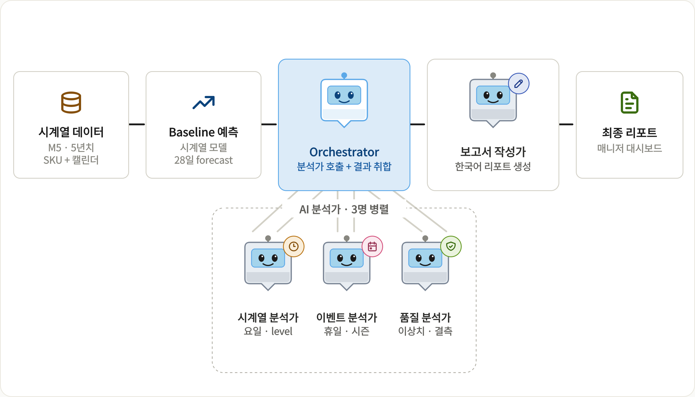

# LLM 에이전트 기반 수요예측 보정 시스템

시계열 모델이 만든 단변량 baseline forecast 위에, **다관점 LLM 분석가들이
보정 multiplier 를 직접 제안** 하고 deterministic 합성 후 매니저용 한국어
보고서를 생성한다. 매니저는 Streamlit 대시보드에서 결과를 검토·수정·확정.

> 데이터: Kaggle M5 Walmart Forecasting Dataset (2011 – 2016, 30,490 SKU)



---

## 시스템 구성

5명의 LLM 에이전트 + 3개 deterministic 단계로 이루어진 파이프라인:

| 단계 | 컴포넌트 | 역할 | 종류 |
|---|---|---|---|
| 1 | Baseline Forecaster | 시계열 모델로 28일 예측 (level only) | LSTM / SARIMAX |
| 2 | Context Collector | 캘린더에서 이벤트·요일·SNAP 추출 | 코드 |
| 3a | 시계열 분석가 | 요일·level multiplier 제안 | gpt-4o-mini |
| 3b | 이벤트 분석가 | 휴일·시즌 multiplier 제안 | gpt-4o-mini |
| 3c | 품질 분석가 | 이상치·결측 caveat | gpt-4o-mini |
| 4 | Decision Maker | 분석가 신호 합성 | 코드 |
| 5 | Apply | `baseline × ∏ multipliers` (cap 적용) | 코드 |
| 6 | 보고서 작성가 | 한국어 매니저 보고서 (markdown) | gpt-4o (스트리밍) |
| 7 | 매니저 대시보드 | 차트·수정·컨펌 | Streamlit |
| 8 | 챗봇 어시스턴트 | 자연어 → tool call 보정 조작 | gpt-4o-mini |

오케스트레이션은 LangGraph. 매 실행은 `data/runs/<run_id>/` 아래에 결과를 남김.

---

## 환경 설정

```powershell
uv sync                          # 의존성 설치
Copy-Item .env.example .env      # OPENAI_API_KEY 입력
```

Python 3.11+ · uv · Windows PowerShell 기준. macOS / Linux 도 동일 명령으로 동작.

### 환경변수

| 변수 | 기본값 | 설명 |
|---|---|---|
| `OPENAI_API_KEY` | (필수) | OpenAI API 키 |
| `BASELINE_MODEL` | `lstm` | `lstm` 또는 `arima` |
| `OPENAI_MODEL` | `gpt-4o-mini` | specialist 기본 모델 |
| `OPENAI_TEMPERATURE` | `0` | LLM temperature |
| `CHAT_AGENT_MODEL` | `gpt-4o-mini` | 챗봇 모델 |

---

## M5 데이터 준비

Kaggle [M5 Forecasting - Accuracy](https://www.kaggle.com/competitions/m5-forecasting-accuracy)
에서 아래 3개 파일을 다운받아 `data/raw/` 에 둔다:

- `sales_train_evaluation.csv`
- `calendar.csv`
- `sell_prices.csv`

이후 데이터 정제·DuckDB 적재:

```powershell
.\.venv\Scripts\python.exe -m src.data.prepare
```

생성물:
- `data/knowledge_base.duckdb` — `sales_train`, `calendar`, `sell_prices`, `sku_metadata`
- `data/test_set.parquet` — 2016-01-01 ~ 2016-05-22 held-out actual
- `data/calendar.parquet`

---

## 사용 방법

### A. 검토 대시보드 (권장)

```powershell
.\.venv\Scripts\streamlit.exe run app.py
```

브라우저에서 사이드바에 SKU id 와 input 마감일을 입력 → **"▶ AI 에이전트
분석 시작"** 버튼 → 6 단계 status cascade 가 실시간으로 펼쳐지며 분석 진행
(보고서는 토큰 단위 스트리밍). 분석 완료 후 차트가 4 trace (input · baseline ·
에이전트 보정 · 매니저 최종) 로 확장되고, 차트 범례에서 *정답 (test 실측)* 을
토글해 비교 가능.

분석 후 매니저는:
- **일자별 수정** 탭 — `data_editor` 로 셀 직접 수정 + 글로벌 multiplier 슬라이더
- **보정 신호** 탭 — 각 신호 toggle / multiplier 조정
- **보고서** 탭 — 한국어 markdown 보고서
- **💬 챗봇** — 자연어 명령 (예: *"슈퍼볼 보정 빼줘"*, *"15일 35로 바꿔"*,
  *"전체 5% 높여"*) 으로 보정 조작
- **✅ 최종 컨펌 및 저장** — `data/runs/<run_id>/manager_final/<sku>.parquet`

### B. 배치 실행 (CLI)

여러 SKU 를 한꺼번에 돌리려면:

```powershell
# 기본 baseline: LSTM
.\.venv\Scripts\python.exe _e2e_batch_eval.py

# SARIMAX 로 전환
$env:BASELINE_MODEL = "arima"; .\.venv\Scripts\python.exe _e2e_batch_eval.py
```

각 SKU 마다 `data/runs/<run_id>/` 에 다음이 저장됨:

| 파일 | 내용 |
|---|---|
| `reports/<sku>.md` | 매니저용 한국어 보고서 |
| `intermediates/<sku>.md` | 3 분석가 narrative + 채택 신호 |
| `forecasts/<sku>.parquet` | 일자별 baseline · final · applied label |
| `state/<sku>.json` | 검토 앱이 읽는 통합 payload |
| `traces/<sku>.jsonl` | LLM 호출 추적 (토큰·비용) |
| `summary.parquet` / `summary.txt` | run 단위 메트릭 |

per-SKU 평가 breakdown:

```powershell
.\.venv\Scripts\python.exe _multi_breakdown.py
```

---

## 디렉토리 구조

```
.
├ app.py                       # Streamlit 진입점
├ _e2e_batch_eval.py           # 배치 POC 진입점
├ _multi_breakdown.py          # per-SKU 평가 분석
│
├ src/
│   ├ config.py                # 경로·env var 설정
│   ├ data/                    # M5 정제 + DuckDB 적재
│   ├ forecasting/             # baseline 모델 + 분석 도구
│   │   ├ baselines/{lstm, arima}.py
│   │   ├ model.py             # BASELINE_MODEL dispatcher
│   │   ├ analysis.py          # specialist 가 보는 표 (weekday/event/SNAP)
│   │   └ package.py           # PredictionPackage 빌더
│   ├ agents/                  # LangGraph 에이전트들
│   │   ├ workflow.py          # 그래프 정의
│   │   ├ context_collector.py
│   │   ├ pattern_analyst.py   # 3 specialists (gpt-4o-mini)
│   │   ├ decision_maker.py
│   │   ├ forecast_adjuster.py # compound × cap
│   │   ├ report_writer.py     # gpt-4o
│   │   ├ batch.py             # 배치 러너
│   │   ├ prompts.py
│   │   └ _trace.py            # 호출 추적
│   ├ app/                     # Streamlit 검토 앱
│   │   ├ main.py              # 페이지 본체
│   │   ├ live.py              # 라이브 분석 cascade
│   │   ├ loaders.py           # run dir 로딩
│   │   ├ state.py             # 매니저 override 모델
│   │   ├ chat_agent.py        # 챗봇 (tool calling)
│   │   └ components/{chart, edit_table, insights_panel}.py
│   └ evaluation/metrics.py    # MAE · sMAPE · FVA
│
└ data/
    ├ raw/                     # M5 원본 CSV (gitignore)
    ├ knowledge_base.duckdb
    ├ test_set.parquet
    ├ calendar.parquet
    ├ models/                  # baseline 모델 캐시
    │   ├ lstm_flat/<sku>.pt
    │   └ arima/<sku>.pkl
    └ runs/<run_id>/           # 실행 결과 (위 표 참고)
```

---

## 핵심 설계 원칙

- **LLM 이 분석가, 코드는 도구·합성·cap.** 코드에는 multiplier 결정 공식이 박혀
  있지 않다. specialist 가 raw 데이터 (input window, 365일 weekday pattern,
  연도별 event ratio matrix 등) 를 보고 직접 multiplier 를 정한다.
- **단변량 baseline + 외부 컨텍스트 보강.** 시계열 모델은 *level* 만 책임.
  weekly cycle / event spike 는 LLM 분석가가 추가. 두 역할이 겹치지 않도록 분리.
- **Lane separation.** 3 specialist 는 각자 도메인 (요일·이벤트·품질) 만 분석,
  cross-talk 없음. Decision Maker 가 deterministic 하게 합침.
- **자연어 + 구조 출력.** specialist 출력 = `narrative` (영어, 보고서용) +
  `proposed_signals` (구조화). 보고서만 한국어 (gpt-4o).

---

## 참고

- Brau (2023). Demand forecasting and judgmental adjustment. *Journal of Operations Management*
- Petropoulos (2024). Forecasting with large language models. *International Journal of Forecasting*
- Fildes & Petropoulos (2015). Improving forecast quality in practice. *Foresight*
- Makridakis et al. (2022). The M5 accuracy competition. *International Journal of Forecasting*
